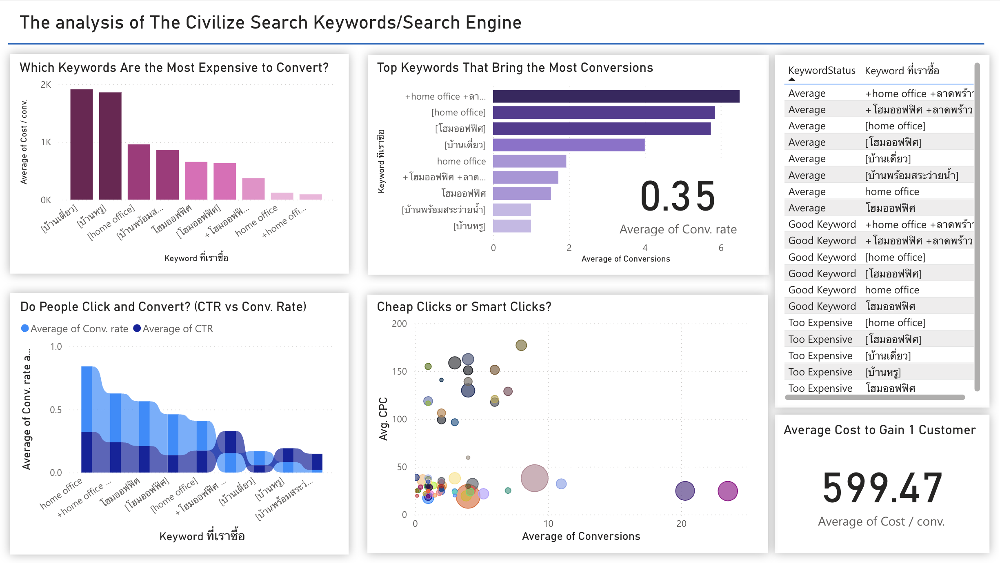

# The Lyst – Power BI Keyword Dashboard

Interactive **Power BI / Excel** analysis of Google Ads search-engine data for  
**The Lyst**, a **฿50 million** home-office development project in Bangkok.  
The dashboard highlights **high-cost keywords**, compares CPC and conversion rates,  
and provides insights to optimize marketing spend.

## Project Highlights
- **Tools**: Power BI, Excel  
- **Data**: Google Ads keyword performance (clicks, CTR, CPC, conversions)  
- **Goal**: Identify profitable and over-priced keywords to improve ad budget allocation  
- **Outcome**: Actionable recommendations for more efficient marketing strategy

## How to View
1. Download the file **`TheCivilizeSearchEngine.pbix`**.  
2. Open it with **[Power BI Desktop](https://powerbi.microsoft.com/desktop/)** (free).  
3. Explore the interactive visuals and filters.

## Dashboard Preview

